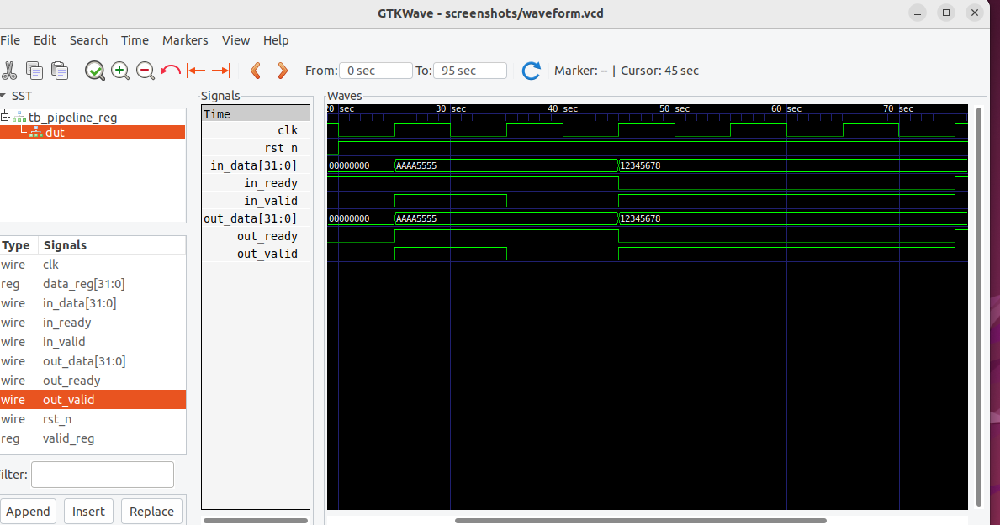

# Single-Stage Pipeline Register (Valid–Ready Handshake)

This repository contains a fully synthesizable single-stage pipeline register
implemented in SystemVerilog using a standard valid–ready handshake.
The design correctly handles backpressure without data loss or duplication.

---

## Source Code (Click to View)

### RTL Design
- [`pipeline_reg.sv`](rtl/pipeline_reg.sv)  
  Implements a single-stage pipeline register with valid–ready handshake and
  backpressure support.

### Testbench
- [`tb_pipeline_reg.sv`](tb/tb_pipeline_reg.sv)  
  SystemVerilog testbench covering normal transfer and backpressure scenarios.

---

## Design Highlights
- Parameterized data width
- Clean reset behavior
- Maximum throughput (1 transfer per cycle)
- Backpressure handled using:

---

## Verification

The design was verified using a self-written SystemVerilog testbench.
Waveforms were analyzed using GTKWave.

### GTKWave Waveform


---

## Repository Structure

---

## 🟢 SAVE & EXIT nano (DO THIS SLOWLY)

1️⃣ Press **Ctrl + O**  
2️⃣ Press **Enter**  
3️⃣ Press **Ctrl + X**

---

## 🟢 Commit & Push

```bash
git add README.md
git commit -m "Fix README formatting and add code links"
git push
